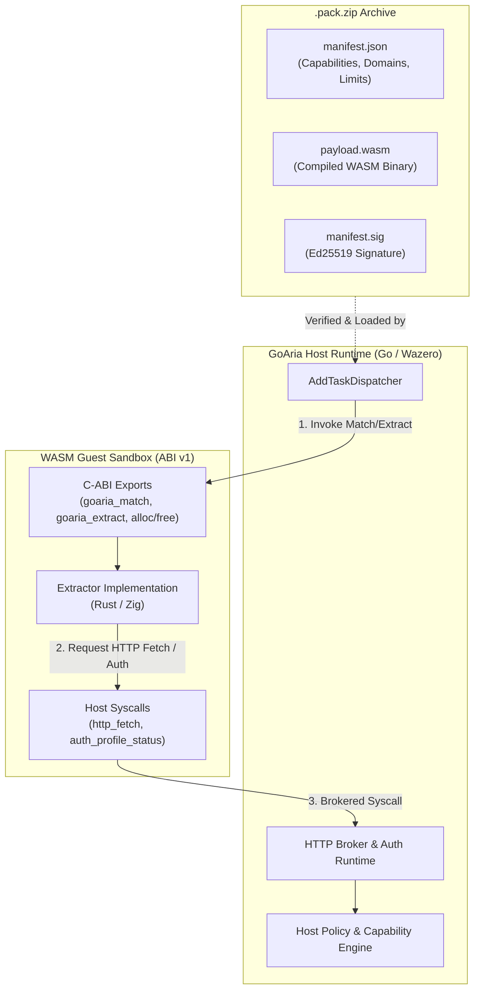

# GoAria Extractor SDK

[](docs/abi_v1_specification.md)
[](https://www.rust-lang.org)
[](https://ziglang.org)
[](LICENSE-MIT)

The official software development kit and toolchain for authoring, testing, and packaging sandboxed WebAssembly link extractors for the **GoAria** download manager ecosystem.

---

## 🏛 Architecture Overview

GoAria extractors run in an isolated WebAssembly sandbox managed by the Go host runtime (`wazero`). Extractors communicate with the host via the **ABI v1** protocol, executing link matching and extraction without direct network or file system access.



---

## 📦 Workspace Structure & Navigation

| Path | Purpose | Documentation |
| :--- | :--- | :--- |
| [`crates/goaria-extractor-sdk`](crates/goaria-extractor-sdk) | High-level Rust SDK library & `#[goaria_extractor]` procedural macro | [Rust Guide](docs/README.md#2-rust-extractor-authoring-guide) |
| [`crates/cargo-goaria-pack`](crates/cargo-goaria-pack) | CLI toolchain (`new`, `build`, `check`, `test`, `run`, `keygen`, `pack`) | [CLI Reference](docs/README.md#4-cli-command-reference-cargo-goaria-pack) |
| [`sdk/zig`](sdk/zig) | Official Zig SDK library for `wasm32-freestanding` | [Zig Guide](docs/README.md#3-zig-extractor-authoring-guide) |
| [`examples/rust_fixture_pack`](examples/rust_fixture_pack) | Production-ready reference extractor written in Rust | [Example Code](examples/rust_fixture_pack) |
| [`examples/zig_minimal_pack`](examples/zig_minimal_pack) | Reference extractor written in Zig 0.16.0 | [Example Code](examples/zig_minimal_pack) |
| [`docs/`](docs/) | Formal specifications, schemas, and developer manuals | [Docs Index](docs/README.md) |

---

## 🚀 Installation & Prerequisites

### Step 0: Choose Your Toolchain

The CLI drives your pack's language toolchain, so install the one matching your `--lang` choice:

**Option A — Zig (recommended on Windows for straightforward extractors)**

A Zig pack needs nothing but the Zig binary itself — no C/C++ build tools and no Rust toolchain:

```powershell
winget install zig.zig    # or: scoop install zig
zig version               # must report 0.16.x
```

**Option B — Rust (required for `--lang rust`)**

```bash
# Install via https://rustup.rs, then add the WASM target:
rustup target add wasm32-unknown-unknown
```

On Windows, Rust packs additionally require **Visual Studio Build Tools** with the *"Desktop development with C++"* workload (MSVC linker + Windows SDK): proc macros compile for the host, so a host linker is needed even though the final artifact is WebAssembly. On Linux install `gcc`/`clang`; on macOS install the Xcode Command Line Tools.

### Install the CLI

**Prebuilt binary** — no Rust toolchain required:

Download the `cargo-goaria-pack-<version>-<target>` archive for your platform from [GitHub Releases](https://github.com/superGekFordJ/goaria-extractor-sdk/releases), verify it against `SHA256SUMS.txt`, unpack it, and place `cargo-goaria-pack` (`cargo-goaria-pack.exe` on Windows) on your `PATH`. On macOS, clear the quarantine attribute after downloading: `xattr -d com.apple.quarantine cargo-goaria-pack`.

**From source** — requires a Rust toolchain:

```bash
cargo install --path crates/cargo-goaria-pack
```

Verify the installation:

```bash
cargo-goaria-pack --version
```

Once on `PATH`, the binary works directly as `cargo-goaria-pack <COMMAND>` and — when Cargo is also installed — as the `cargo goaria-pack <COMMAND>` subcommand. Both forms are equivalent; the docs use the `cargo goaria-pack` spelling.

---

## ⚡ 5-Step Quickstart

### 1. Scaffold a New Extractor
```bash
cargo goaria-pack new my-extractor --lang rust
cd my-extractor
```
The SDK sources are vendored into `vendor/` by default so the project builds standalone; use `--sdk git` to depend on the GitHub repo instead.

### 2. Implement URL Matching & Extraction
Edit `src/lib.rs` to define pattern matching and artifact extraction rules using the Rust SDK.

### 3. Build the WebAssembly Module
```bash
cargo goaria-pack build
```

### 4. Verify and Test Locally
```bash
cargo goaria-pack check
cargo goaria-pack test
cargo goaria-pack run https://share.fixture.invalid/item/123
```

### 5. Sign and Package for Distribution
```bash
cargo goaria-pack pack --out-dir dist
```

---

## 🔒 Security Principles

- **Host-Custody Credential Isolation**: WebAssembly guest plugins never store or access raw authorization tokens, secrets, or cookies. All authentication is attached securely by the host runtime.
- **Granular Capabilities**: Plugins explicitly declare permissions (`cap.parse.wasm`, `cap.http.fetch`, `cap.http.fetch.extended`, `cap.auth.profile`) in `manifest.json`.
- **Zero Domain Leakage**: Development, testing, and fixture suites use RFC 2606 reserved domains (`fixture.invalid`, `example.com`).
- **Cryptographic Supply Chain Integrity**: Packs are packaged deterministically and signed with Ed25519 digital signatures.

---

## 📚 Specification & References

- **[Developer Guide & Quickstart](docs/README.md)**: Full authoring tutorials for Rust & Zig.
- **[ABI v1 Formal Specification](docs/abi_v1_specification.md)**: Authoritative technical specification of the ABI binary interface.
- **[Manifest JSON Schema](docs/manifest_schema.json)**: JSON Schema Draft-07 specification for `manifest.json`.
