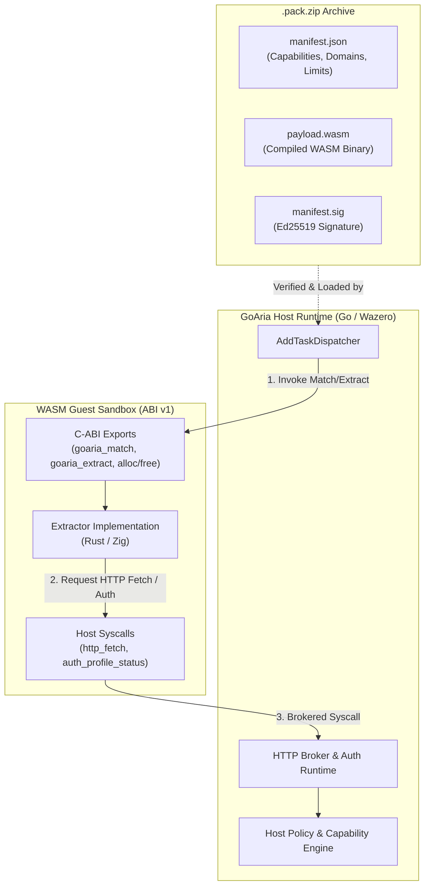

# GoAria Extractor SDK

[](https://github.com/goaria/goaria-extractor-sdk/actions/workflows/ci.yml)
[](docs/abi_v1_specification.md)
[](https://www.rust-lang.org)
[](https://ziglang.org)
[](LICENSE)

The official software development kit and toolchain for authoring, testing, and packaging sandboxed WebAssembly link extractors for the **GoAria** download manager ecosystem.

---

## 🏛 Architecture Overview

GoAria extractors run in an isolated WebAssembly sandbox managed by the Go host runtime (`wazero`). Extractors communicate with the host via the **ABI v1** protocol, executing link matching and extraction without direct network or file system access.



---

## 📦 Workspace Structure & Navigation

| Path | Purpose | Documentation |
| :--- | :--- | :--- |
| [`crates/goaria-extractor-sdk`](crates/goaria-extractor-sdk) | High-level Rust SDK library & `#[goaria_pack]` procedural macro | [Rust Guide](docs/README.md#2-rust-extractor-authoring-guide) |
| [`crates/cargo-goaria-pack`](crates/cargo-goaria-pack) | CLI toolchain (`new`, `build`, `check`, `test`, `run`, `keygen`, `pack`) | [CLI Reference](docs/README.md#4-cli-command-reference-cargo-goaria-pack) |
| [`sdk/zig`](sdk/zig) | Official Zig SDK library for `wasm32-freestanding` | [Zig Guide](docs/README.md#3-zig-extractor-authoring-guide) |
| [`examples/rust_fixture_pack`](examples/rust_fixture_pack) | Production-ready reference extractor written in Rust | [Example Code](examples/rust_fixture_pack) |
| [`examples/zig_minimal_pack`](examples/zig_minimal_pack) | Reference extractor written in Zig 0.16.0 | [Example Code](examples/zig_minimal_pack) |
| [`docs/`](docs/) | Formal specifications, schemas, and developer manuals | [Docs Index](docs/README.md) |

---

## 🚀 Quick Installation

Install the CLI toolchain via Cargo:

```bash
cargo install --path crates/cargo-goaria-pack
```

Verify the installation:

```bash
cargo goaria-pack --version
```

---

## ⚡ 5-Step Quickstart

### 1. Scaffold a New Extractor
```bash
cargo goaria-pack new my-extractor --lang rust
cd my-extractor
```

### 2. Implement URL Matching & Extraction
Edit `src/lib.rs` to define pattern matching and artifact extraction rules using the Rust SDK.

### 3. Verify Static ABI & Bytecode
```bash
cargo goaria-pack check
```

### 4. Test Extraction with Local Mock Broker
```bash
cargo goaria-pack run https://share.fixture.invalid/item/123
```

### 5. Build, Sign, and Package for Distribution
```bash
cargo goaria-pack pack --out-dir dist
```

---

## 🔒 Security Principles

- **Host-Custody Credential Isolation**: WebAssembly guest plugins never store or access raw authorization tokens, secrets, or cookies. All authentication is attached securely by the host runtime.
- **Granular Capabilities**: Plugins explicitly declare permissions (`cap.parse.wasm`, `cap.http.fetch`, `cap.auth.profile`) in `manifest.json`.
- **Zero Domain Leakage**: Development, testing, and fixture suites use RFC 2606 reserved domains (`fixture.invalid`, `example.com`).
- **Cryptographic Supply Chain Integrity**: Packs are packaged deterministically and signed with Ed25519 digital signatures.

---

## 📚 Specification & References

- **[Developer Guide & Quickstart](docs/README.md)**: Full authoring tutorials for Rust & Zig.
- **[ABI v1 Formal Specification](docs/abi_v1_specification.md)**: Authoritative technical specification of the ABI binary interface.
- **[Manifest JSON Schema](docs/manifest_schema.json)**: JSON Schema Draft-07 specification for `manifest.json`.
