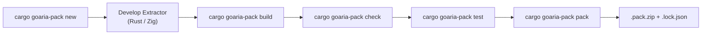

# GoAria Extractor SDK & Pack Developer Guide

Welcome to the official developer manual for the **GoAria WebAssembly Extractor SDK**. This document covers authoring, debugging, verifying, and packaging link extractors in Rust and Zig.

---

## 1. End-to-End Workflow



### Step 1: Initialize Project
```bash
cargo goaria-pack new my-extractor --lang rust
cd my-extractor
```

### Step 2: Configure Permissions (`manifest.json`)
Declare granular capabilities and domain rules matching your target site.

### Step 3: Build the WebAssembly Module
```bash
cargo goaria-pack build
```

### Step 4: Run Static Checks and Local Tests
```bash
cargo goaria-pack check
cargo goaria-pack test
```
Or interactively test matching and extraction:
```bash
cargo goaria-pack run https://share.fixture.invalid/item/123
```

### Step 5: Package for Distribution
```bash
cargo goaria-pack pack --out-dir dist
```
This verifies the compiled WebAssembly binary, embeds the canonical manifest, generates the Ed25519 cryptographic signature, and produces a deterministic `.pack.zip` and `.lock.json` in `dist/`.

---

## 2. Rust Extractor Authoring Guide

### 2.1 Project Configuration (`Cargo.toml`)

Ensure `crate-type = ["cdylib", "rlib"]` is configured:

```toml
[package]
name = "my-extractor"
version = "0.1.0"
edition = "2021"

[lib]
crate-type = ["cdylib", "rlib"]

[dependencies]
goaria-extractor-sdk = "0.1.0"
serde = { version = "1.0", default-features = false, features = ["derive", "alloc"] }
serde_json = { version = "1.0", default-features = false, features = ["alloc"] }
```

### 2.2 Implementing the `Extractor` Trait

Annotate your extractor struct with `#[goaria_extractor]` and `#[derive(Default)]` to automatically wire memory management and C-ABI exports. The legacy `#[goaria_pack]` spelling remains a compatibility alias for existing packs:

```rust
use goaria_extractor_sdk::prelude::*;

#[goaria_extractor]
#[derive(Default)]
pub struct MyExtractor;

#[derive(serde::Deserialize)]
struct ApiItemResponse {
    download_url: String,
    filename: String,
    size_bytes: i64,
}

impl Extractor for MyExtractor {
    fn match_url(&self, input: MatchInput) -> Result<MatchOutput, ExtractorError> {
        if input.url.starts_with("https://share.fixture.invalid/") {
            Ok(MatchOutput::matched().with_confidence(100))
        } else {
            Ok(MatchOutput::unmatched())
        }
    }

    fn extract(&self, input: ExtractInput) -> Result<ExtractOutput, ExtractorError> {
        let broker = HostBroker::new();
        let api_url = format!("https://api.fixture.invalid/v1/resolve?url={}", input.url);
        let response = broker.fetch_json::<ApiItemResponse>(&HostHTTPFetchRequest {
            method: Some("GET".to_string()),
            url: Some(api_url),
            ..Default::default()
        })?;

        let item = ExtractedItemRef {
            url: Some(response.download_url),
            filename: Some(response.filename),
            size_bytes: Some(response.size_bytes),
            mime_type: Some("application/octet-stream".to_string()),
            auth_profile_ref: Some("default".to_string()),
            ..Default::default()
        };

        Ok(ExtractOutput::single(item))
    }
}
```

### 2.3 Host-Custody Credentials
Notice that extractors never handle raw tokens, cookies, or secrets. Instead, the extractor supplies an opaque reference (e.g. `auth_profile_ref: Some("default".to_string())`), and the GoAria host injects credentials securely.

---

## 3. Zig Extractor Authoring Guide

### 3.1 Build Configuration (`build.zig`)

```zig
const std = @import("std");

pub fn build(b: *std.Build) void {
    const target = b.resolveTargetQuery(.{
        .cpu_arch = .wasm32,
        .os_tag = .freestanding,
    });
    const optimize = b.standardOptimizeOption(.{
        .preferred_optimize_mode = .ReleaseSmall,
    });

    const lib = b.addSharedLibrary(.{
        .name = "payload",
        .root_source_file = b.path("src/main.zig"),
        .target = target,
        .optimize = optimize,
    });

    lib.rdynamic = true;
    lib.entry = .disabled;

    b.installArtifact(lib);
}
```

### 3.2 Extractor Implementation (`src/main.zig`)

```zig
const std = @import("std");

var allocator = std.heap.page_allocator;

inline fn packResult(ptr: u32, len: u32) i64 {
    const val = (@as(u64, ptr) << 32) | @as(u64, len);
    return @bitCast(val);
}

export fn goaria_abi_version() callconv(.c) i32 {
    return 1;
}

export fn goaria_alloc(len: i32) callconv(.c) i32 {
    if (len <= 0) return 0;
    const slice = allocator.alloc(u8, @intCast(len)) catch return 0;
    return @intCast(@intFromPtr(slice.ptr));
}

export fn goaria_free(ptr: i32, len: i32) callconv(.c) void {
    if (ptr <= 0 or len <= 0) return;
    const u_ptr: usize = @as(usize, @as(u32, @bitCast(ptr)));
    const slice: []u8 = @as([*]u8, @ptrFromInt(u_ptr))[0..@as(usize, @as(u32, @bitCast(len)))];
    allocator.free(slice);
}

export fn goaria_match(ptr: i32, len: i32) callconv(.c) i64 {
    _ = ptr;
    _ = len;
    const result = "{\"matched\":true,\"confidence\":100,\"reason\":\"matches fixture domain\"}";
    const out_slice = allocator.alloc(u8, result.len) catch return 0;
    @memcpy(out_slice, result);
    return packResult(@truncate(@intFromPtr(out_slice.ptr)), @intCast(result.len));
}

export fn goaria_extract(ptr: i32, len: i32) callconv(.c) i64 {
    _ = ptr;
    _ = len;
    const result = "{\"items\":[{\"id\":\"item-001\",\"url\":\"https://fixture.invalid/file.bin\",\"filename\":\"file.bin\"}]}";
    const out_slice = allocator.alloc(u8, result.len) catch return 0;
    @memcpy(out_slice, result);
    return packResult(@truncate(@intFromPtr(out_slice.ptr)), @intCast(result.len));
}
```

---

## 4. CLI Command Reference (`cargo-goaria-pack`)

| Command | Syntax | Description |
| :--- | :--- | :--- |
| `new` | `cargo goaria-pack new <NAME> [--lang rust\|zig] [--path <PATH>]` | Scaffolds a new extractor pack project. |
| `build` | `cargo goaria-pack build [--project-dir <DIR>] [--release]` | Compiles the extractor WebAssembly module. |
| `check` | `cargo goaria-pack check [--project-dir <DIR>] [--wasm <PATH>] [--manifest <PATH>]` | Statically analyzes WASM exports, imports, and validates manifest.json. |
| `test` | `cargo goaria-pack test [--project-dir <DIR>] [--live] [--fixtures <DIR>]` | Executes unit test fixtures in the local WASM interpreter sandbox. |
| `run` | `cargo goaria-pack run <URL> [--project-dir <DIR>] [--live] [--auth-profile <ID>] [--auth-secret <SECRET>]` | Runs extractor matching and extraction interactively on a URL. |
| `keygen` | `cargo goaria-pack keygen --out-seed <NEW_PATH> [--out-pub <PATH>]` | Generates a new Ed25519 signing keypair without printing or overwriting the private seed. |
| `sign` | `cargo goaria-pack sign --key <KEY_OR_PATH> [--manifest <PATH>] [--out <PATH>]` | Signs manifest.json with an Ed25519 private key. |
| `pack` | `cargo goaria-pack pack [--project-dir <DIR>] [--out-dir <DIR>] [-k, --sign-key <KEY_OR_PATH>] [--asset-name <NAME>] [--skip-build]` | Builds, checks, signs, and packages deterministic .pack.zip and lockfile. |

---

## 5. Testing & Sandboxing

### 5.1 Local Execution (`run`)

Test extraction with a mock broker:
```bash
cargo goaria-pack run https://share.fixture.invalid/item/123
```

Simulate an authenticated session with an auth profile:
```bash
cargo goaria-pack run https://share.fixture.invalid/item/123 \
  --auth-profile default \
  --auth-secret my-developer-token
```

Execute with live network access:
```bash
cargo goaria-pack run https://share.fixture.invalid/item/123 --live
```
Live mode resolves and rejects non-public addresses inside the transport resolver used for the actual connection, preserving the original hostname for HTTP `Host` and TLS SNI/certificate validation. Basic fetch requests follow at most 5 redirects with per-hop domain/SSRF re-checks; extended fetch requests (`cap.http.fetch.extended`) fail closed on any redirect and require HTTPS.

### 5.2 Host-Visible Buffer Ownership Check
The CLI verifies balanced ownership for ABI buffers visible to the host, including host-created input buffers and guest-returned output buffers. It cannot observe arbitrary allocations inside the guest allocator, so this check is not whole-guest leak detection and does not claim an exact leaked-byte count.

### 5.3 Execution Budget and Panic Isolation
The production Go/Wazero host treats manifest `timeout_millis` as a cancellable wall-clock deadline. The local `wasmi` runner converts the same value into an approximate fuel/instruction budget for CPU-bound guest code; fuel cannot preempt a blocking host call and is not a wall-clock guarantee. Live HTTP request timeouts are separately capped by the manifest limit.

For Rust `wasm32-unknown-unknown`, the default `panic=abort` behavior emits a WebAssembly `unreachable` trap. `catch_unwind` cannot recover that panic; the host runtime isolates and reports the trap. ABI v1 has no structured `goaria_extract` error envelope, so ordinary returned extractor errors currently map to an empty `ExtractOutput`.

---

## 6. Packaging, Signing & Distribution

### 6.1 Cryptographic Key Generation
```bash
cargo goaria-pack keygen \
  --out-seed ~/.goaria/keys/seed.hex \
  --out-pub ~/.goaria/keys/key.pub
```

### 6.2 Deterministic Pack Generation
```bash
cargo goaria-pack pack \
  --project-dir . \
  --out-dir dist \
  --sign-key ~/.goaria/keys/seed.hex
```

---

## 7. Security Principles & Capabilities

1. **Host-Custody Credential Isolation**: Raw tokens and cookies never touch guest WebAssembly memory.
2. **Capability Declarations**: Extractors must declare `cap.parse.wasm`, `cap.http.fetch`, `cap.http.fetch.extended`, or `cap.auth.profile` in `manifest.json`. The extended fetch capability covers `POST`/`body_base64` and pack-owned `Authorization`/`X-*` headers; it requires `cap.http.fetch` and cannot be combined with `auth_profile_ref`.
3. **No-Name Policy / Zero Domain Leakage**: All tests, fixtures, and documentation strictly use RFC 2606 reserved domains (`fixture.invalid`, `example.com`).
4. **Supply Chain Integrity**: Every pack is digitally signed with Ed25519 and verified against the GoAria host trust policy before execution.