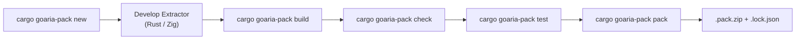

# GoAria Extractor SDK & Pack Developer Guide

Welcome to the official developer manual for the **GoAria WebAssembly Extractor SDK**. This document covers authoring, debugging, verifying, and packaging link extractors in Rust and Zig.

---

## 1. End-to-End Workflow



### Step 0: Install the CLI

- **Prebuilt binary** (no Rust toolchain needed): download `cargo-goaria-pack-<version>-<target>` from [GitHub Releases](https://github.com/superGekFordJ/goaria-extractor-sdk/releases) and place it on your `PATH`.
- **From source**: `cargo install --path crates/cargo-goaria-pack`.

All examples below use the `cargo goaria-pack` form; standalone-binary users run `cargo-goaria-pack` directly — the interface is identical.

### Step 1: Initialize Project
```bash
cargo goaria-pack new my-extractor --lang rust
cd my-extractor
```
By default (`--sdk vendor`), the SDK sources are embedded into `vendor/` so the project builds standalone. Alternatives: `--sdk git [--sdk-ref <REF>]` to depend on the GitHub repository, `--sdk crates` for the crates.io version, or `--sdk-path <DIR>` to point at a local SDK checkout.

### Step 2: Configure Permissions (`manifest.json`)
Declare granular capabilities and domain rules matching your target site.

### Step 3: Build the WebAssembly Module
```bash
cargo goaria-pack build
```

### Step 4: Run Static Checks and Local Tests
```bash
cargo goaria-pack check
cargo goaria-pack test
```
Or interactively test matching and extraction:
```bash
cargo goaria-pack run https://share.fixture.invalid/item/123
```

### Step 5: Package for Distribution
```bash
cargo goaria-pack pack --out-dir dist
```
This verifies the compiled WebAssembly binary, embeds the canonical manifest, generates the Ed25519 cryptographic signature, and produces a deterministic `.pack.zip` and `.lock.json` in `dist/`.

---

## 2. Rust Extractor Authoring Guide

### 2.1 Project Configuration (`Cargo.toml`)

Ensure `crate-type = ["cdylib", "rlib"]` is configured:

```toml
[package]
name = "my-extractor"
version = "0.1.0"
edition = "2021"

[lib]
crate-type = ["cdylib", "rlib"]

[dependencies]
goaria-extractor-sdk = { path = "vendor/goaria-extractor-sdk" }
serde = { version = "1.0", default-features = false, features = ["derive", "alloc"] }
serde_json = { version = "1.0", default-features = false, features = ["alloc"] }
```

The `goaria-extractor-sdk` dependency line depends on the `--sdk` source chosen at scaffold time:

| Mode | Generated dependency |
| :--- | :--- |
| `--sdk vendor` (default) | `goaria-extractor-sdk = { path = "vendor/goaria-extractor-sdk" }` — SDK + proc-macro crates are copied into `vendor/` with flattened standalone manifests; commit `vendor/` to version control. |
| `--sdk git [--sdk-ref <REF>]` | `goaria-extractor-sdk = { git = "https://github.com/superGekFordJ/goaria-extractor-sdk"[, rev = "<REF>"] }` |
| `--sdk crates` | `goaria-extractor-sdk = "0.1.0"` — placeholder until the crate is published. |
| `--sdk-path <DIR>` | `goaria-extractor-sdk = { path = "<absolute DIR>" }` — local SDK checkout. |

### 2.2 Implementing the `Extractor` Trait

Annotate your extractor struct with `#[goaria_extractor]` and `#[derive(Default)]` to automatically wire memory management and C-ABI exports. The legacy `#[goaria_pack]` spelling remains a compatibility alias for existing packs:

```rust
use goaria_extractor_sdk::prelude::*;

#[goaria_extractor]
#[derive(Default)]
pub struct MyExtractor;

#[derive(serde::Deserialize)]
struct ApiItemResponse {
    download_url: String,
    filename: String,
    size_bytes: i64,
}

impl Extractor for MyExtractor {
    fn match_url(&self, input: MatchInput) -> Result<MatchOutput, ExtractorError> {
        if input.url.starts_with("https://share.fixture.invalid/") {
            Ok(MatchOutput::matched().with_confidence(100))
        } else {
            Ok(MatchOutput::unmatched())
        }
    }

    fn extract(&self, input: ExtractInput) -> Result<ExtractOutput, ExtractorError> {
        let broker = HostBroker::new();
        let api_url = format!("https://api.fixture.invalid/v1/resolve?url={}", input.url);
        let response = broker.fetch_json::<ApiItemResponse>(&HostHTTPFetchRequest {
            method: Some("GET".to_string()),
            url: Some(api_url),
            ..Default::default()
        })?;

        let item = ExtractedItemRef {
            url: Some(response.download_url),
            filename: Some(response.filename),
            size_bytes: Some(response.size_bytes),
            mime_type: Some("application/octet-stream".to_string()),
            auth_profile_ref: Some("default".to_string()),
            ..Default::default()
        };

        Ok(ExtractOutput::single(item))
    }
}
```

### 2.3 Host-Custody Credentials
Notice that extractors never handle raw tokens, cookies, or secrets. Instead, the extractor supplies an opaque reference (e.g. `auth_profile_ref: Some("default".to_string())`), and the GoAria host injects credentials securely.

---

## 3. Zig Extractor Authoring Guide

### 3.1 Build Configuration (`build.zig` + `build.zig.zon`)

Scaffolded zig packs consume the vendored `goaria_sdk` package via a `.path` dependency:

```zig
const std = @import("std");

pub fn build(b: *std.Build) void {
    const target = b.resolveTargetQuery(.{
        .cpu_arch = .wasm32,
        .os_tag = .freestanding,
    });
    const optimize = b.standardOptimizeOption(.{
        .preferred_optimize_mode = .ReleaseSmall,
    });

    const sdk_dep = b.dependency("goaria_sdk", .{
        .target = target,
        .optimize = optimize,
    });
    const sdk_mod = sdk_dep.module("goaria_sdk");

    const wasm = b.addExecutable(.{
        .name = "my_extractor",
        .root_module = b.createModule(.{
            .root_source_file = b.path("src/main.zig"),
            .target = target,
            .optimize = optimize,
            .strip = true,
            .imports = &.{ .{ .name = "goaria_sdk", .module = sdk_mod } },
        }),
    });

    wasm.entry = .disabled;
    wasm.rdynamic = true;

    b.installArtifact(wasm);
}
```

```zig
// build.zig.zon
.{
    .name = .my_extractor,
    .version = "0.1.0",
    .fingerprint = 0x0123456789abcdef,
    .minimum_zig_version = "0.16.0",
    .dependencies = .{
        .goaria_sdk = .{
            .path = "vendor/goaria_sdk",
        },
    },
    .paths = .{
        "build.zig",
        "build.zig.zon",
        "manifest.json",
        "src",
    },
}
```

Zig package names must be bare identifiers; the CLI normalizes hyphens to underscores and falls back to a `pack_` prefix for names that would collide with a zig keyword or start with a digit. `--sdk git`/`--sdk crates` are not supported for zig — use the default vendored copy or `--sdk-path <DIR>` (which copies the SDK package into `vendor/goaria_sdk/`).

### 3.2 Extractor Implementation (`src/main.zig`)

```zig
const std = @import("std");
const goaria = @import("goaria_sdk");

pub const MyExtractor = struct {
    pub fn matchUrl(allocator: std.mem.Allocator, input: goaria.MatchInput) !goaria.MatchOutput {
        _ = allocator;
        if (std.mem.indexOf(u8, input.url, "fixture.invalid") != null) {
            return goaria.MatchOutput.matchedResult()
                .withConfidence(100)
                .withReason("matches fixture.invalid domain");
        }
        return goaria.MatchOutput.unmatchedResult();
    }

    pub fn extract(allocator: std.mem.Allocator, input: goaria.ExtractInput) !goaria.ExtractOutput {
        if (std.mem.indexOf(u8, input.url, "fixture.invalid") == null) {
            return goaria.ExtractOutput.empty();
        }

        const item = goaria.ExtractedItemRef{
            .id = "item-001",
            .url = input.url,
            .filename = "download.bin",
            .mime_type = "application/octet-stream",
        };

        return try goaria.ExtractOutput.single(allocator, item);
    }
};

comptime {
    goaria.exportExtractor(MyExtractor);
}
```

`goaria.exportExtractor` generates the five ABI v1 exports (`goaria_abi_version`, `goaria_alloc`, `goaria_free`, `goaria_match`, `goaria_extract`) plus guest memory management.

---

## 4. CLI Command Reference (`cargo-goaria-pack`)

| Command | Syntax | Description |
| :--- | :--- | :--- |
| `new` | `cargo goaria-pack new <NAME> [--lang rust\|zig] [--path <PATH>] [--sdk vendor\|git\|crates] [--sdk-ref <REF>] [--sdk-path <DIR>]` | Scaffolds a new extractor pack project (default: vendored SDK sources). |
| `build` | `cargo goaria-pack build [--project-dir <DIR>] [--release]` | Compiles the extractor WebAssembly module. |
| `check` | `cargo goaria-pack check [--project-dir <DIR>] [--wasm <PATH>] [--manifest <PATH>]` | Statically analyzes WASM exports, imports, and validates manifest.json. |
| `test` | `cargo goaria-pack test [--project-dir <DIR>] [--live] [--fixtures <DIR>]` | Executes unit test fixtures in the local WASM interpreter sandbox. |
| `run` | `cargo goaria-pack run <URL> [--project-dir <DIR>] [--live] [--auth-profile <ID>] [--auth-secret <SECRET>]` | Runs extractor matching and extraction interactively on a URL. |
| `keygen` | `cargo goaria-pack keygen --out-seed <NEW_PATH> [--out-pub <PATH>]` | Generates a new Ed25519 signing keypair without printing or overwriting the private seed. |
| `sign` | `cargo goaria-pack sign --key <KEY_OR_PATH> [--manifest <PATH>] [--out <PATH>]` | Signs manifest.json with an Ed25519 private key. |
| `pack` | `cargo goaria-pack pack [--project-dir <DIR>] [--out-dir <DIR>] [-k, --sign-key <KEY_OR_PATH>] [--asset-name <NAME>] [--skip-build]` | Builds, checks, signs, and packages deterministic .pack.zip and lockfile. |

---

## 5. Testing & Sandboxing

### 5.1 Local Execution (`run`)

Test extraction with a mock broker:
```bash
cargo goaria-pack run https://share.fixture.invalid/item/123
```

Simulate an authenticated session with an auth profile:
```bash
cargo goaria-pack run https://share.fixture.invalid/item/123 \
  --auth-profile default \
  --auth-secret my-developer-token
```
The flag registers a simulated `bearer` profile; on fetch hops the local runner sets the `Authorization` header to the secret verbatim. The production host normalizes a stored bearer credential to `Authorization: Bearer <token>`, so pass the full scheme-qualified value (e.g. `--auth-secret "Bearer my-token"`) to mirror the materialized host header. Other host auth kinds (e.g. Cookie profiles) are not simulated by `--auth-secret`.

Execute with live network access:
```bash
cargo goaria-pack run https://share.fixture.invalid/item/123 --live
```
Live mode resolves and rejects non-public addresses inside the transport resolver used for the actual connection, preserving the original hostname for HTTP `Host` and TLS SNI/certificate validation. Basic fetch requests follow at most 5 redirects with per-hop domain/SSRF re-checks; extended fetch requests (`cap.http.fetch.extended`) fail closed on any redirect and require HTTPS. Auth-bearing requests require an HTTPS target on every hop. These egress rules are the same ones the production host broker enforces.

Mock fixtures consumed by `test`/`run` are JSON objects (or arrays of objects) with:
- exactly one URL pattern: `url`, `exact`, `prefix`, or `pattern` (`prefix` matches by string prefix; the other three match exactly);
- optional `status_code`/`status` (integer 100–599, default `200`);
- optional `headers` (`name: string | string[]`), `json`, `body_base64`, or `body` shaping the mock response. Only the safe response-header allowlist is exposed to the guest;
- optional `expect` asserting the outgoing request: `method` (case-insensitive), `headers` (canonical-insensitive name → exact value), `body_base64` (decoded byte equality), `broker_policy_ref`/`endpoint_ref` (exact ref match for ref-mode requests). Every declared field must match or the rule is skipped. Ref-mode requests carry no URL, so a rule matching them still needs a placeholder pattern field (any value); matching then decides on `expect` alone.

### 5.2 Host-Visible Buffer Ownership Check
The CLI verifies balanced ownership for ABI buffers visible to the host, including host-created input buffers and guest-returned output buffers. It cannot observe arbitrary allocations inside the guest allocator, so this check is not whole-guest leak detection and does not claim an exact leaked-byte count.

### 5.3 Execution Budget and Panic Isolation
The production Go/Wazero host treats manifest `timeout_millis` as a cancellable wall-clock deadline. The local `wasmi` runner converts the same value into an approximate fuel/instruction budget for CPU-bound guest code (`timeout_millis` × 1,000,000 fuel units); fuel cannot preempt a blocking host call and is not a wall-clock guarantee. Live HTTP request timeouts are separate: the effective per-request deadline is the smallest positive of the request `timeout_millis`, the manifest limit, and the broker policy maximum (10s).

For Rust `wasm32-unknown-unknown`, the default `panic=abort` behavior emits a WebAssembly `unreachable` trap. `catch_unwind` cannot recover that panic; the host runtime isolates and reports the trap. ABI v1 has no structured `goaria_extract` error envelope, so ordinary returned extractor errors currently map to an empty `ExtractOutput`.

---

## 6. Packaging, Signing & Distribution

### 6.1 Cryptographic Key Generation
```bash
cargo goaria-pack keygen \
  --out-seed ~/.goaria/keys/seed.hex \
  --out-pub ~/.goaria/keys/key.pub
```

**Signer continuity**: the Ed25519 public key is part of the pack's verified identity — the host computes `public_key_sha256` from the key that passed signature verification and keys pack-scoped auth-runtime and host-policy state on the full verified identity (pack ID, version, and the asset/manifest/payload/signature/public-key SHA-256 digests). Sign every release of a pack with the **same key** so updates are recognized as the same publisher; signing with a different key produces a new identity that does not match the stored auth-runtime entry, so previously granted auth sessions no longer resolve. Back up the seed file — `keygen` never overwrites, and a lost seed cannot be recovered.

Note that `pack` without `--sign-key` generates a fresh **ephemeral** keypair each run (with a printed warning), which never forms a stable identity. Always pass `--sign-key` for anything you intend to install or update.

### 6.2 Deterministic Pack Generation
```bash
cargo goaria-pack pack \
  --project-dir . \
  --out-dir dist \
  --sign-key ~/.goaria/keys/seed.hex
```

---

## 7. Security Principles & Capabilities

1. **Host-Custody Credential Isolation**: Raw tokens and cookies never touch guest WebAssembly memory.
2. **Capability Declarations**: Extractors declare capabilities in `manifest.json`: `cap.parse.wasm` (required by every pack), `cap.http.fetch`, `cap.http.fetch.extended`, `cap.auth.profile`, and `cap.download.auth`. The extended fetch capability covers `POST`/`body_base64` and pack-owned `Authorization`/`X-*` headers; it requires `cap.http.fetch` and cannot be combined with `auth_profile_ref`. `cap.download.auth` covers `goaria_host.register_download_auth` for pack-minted bearer credentials; `goaria_host.host_time` requires no capability.
3. **No-Name Policy / Zero Domain Leakage**: All tests, fixtures, and documentation strictly use RFC 2606 reserved domains (`fixture.invalid`, `example.com`).
4. **Supply Chain Integrity**: Every pack is digitally signed with Ed25519 and verified against the GoAria host trust policy before execution.